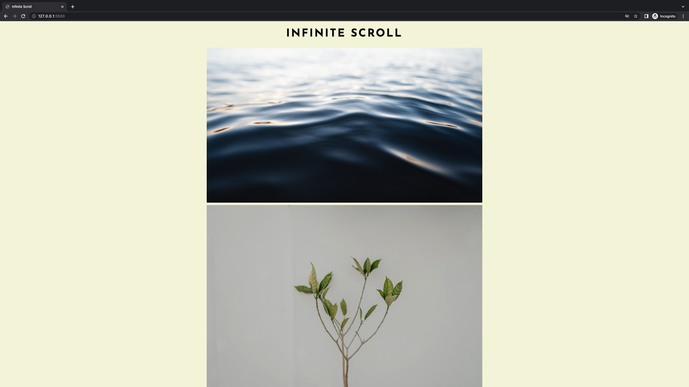

# Infinite Random Images with **Infinite Scroll** | **HTML** & **CSS** & **Vanilla JavaScript**

> Infinite scrolling is so powerful for social media apps, any news websites, article websites like Medium etc. Many apps like Instagram, Facebook include this perfect UX prop. and it makes everything easier, saves our time from refreshing. So I used infinite scrolling for fetching infinite images from Unsplash. It fetches 20 images for every fetching session.

---

## I've Used

- Unsplash API, **random** and **count** customizations included.
- An animated loading svg, I created the svg from loading.io.
- A functional attribution setter.
- A simple **async/await**.
- **Infinite scrolling** , thanks to **offsetHeight**, a web API: _WINDOW_. I used the innerHeight and scrollY properties.

## Example Image

